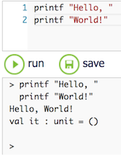
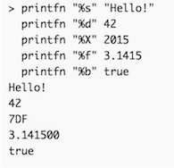

# Day #1 – Calling functions with literals
Let's start our F# journey with the obligatory "Hello, World!" program ;-). Here's how it looks in the online F# editor at [tryfsharp.org](http://www.tryfsharp.org/Create):


`printfn` (print formatted) is the function you call to write data to standard output as text. It prints the data and advances the cursor to the next line:


If you use `printf` (without the "n") then there will be no line break between successive outputs:



This is nifty, you might say ;-). But what is this `unit = ()` thing after the output? Function calls in F# always return a value; or even: everything in F# produces a value. But what kind of result should `printf` produce? Its purpose is to produce a side effect on standard output. Nevertheless, it produces a result of type `unit`; think of it as a "never mind" result. That's what the last line of the output is about. We'll get to that on a later day. For now, ignore it.

## Simple function calls
This was easy – as it was supposed to be. Still, there is something to learn here: how to call a function in the functional programming language of F#.

Just write the name of the function – `printfn` in this example – followed by any parameters. No parentheses, no delimiters except spaces are required. (However, `printfn ("Hello, World!")` would work just fine, too.)

Let's try this with two parameters:

```fsharp
printfn "Hello, %s!" "Peter"
```

Since the format string contains a placeholder (`"%s"`), the function expects another parameter to insert into the output, which becomes `Hello, Peter!`.

Common placeholders are:

* %s for strings
* %d for signed integers
* %X for upper-case hexadecimal output of integers
* %f for floating-point numbers
* %b for boolean values, prints `true` or `false`
* %A for non-primitive typed data, e.g. lists



Read more about placeholders and output formatting in the [printf documentation](https://msdn.microsoft.com/en-us/library/ee370560.aspx).

Finally, a function call with even more parameters:

```fsharp
printfn "%s, %d, %f, %b" "Hello!" 42 3.1415 true
```

## Literals
The second thing to learn from the use of `printfn` is: literals. There are certain rules for how to format literal values in F# code. They are simple, but they exist nonetheless.

Above, you've already seen a couple of literals. Each is associated with a data type, e.g.

* `"Hello!"` is a `string`
* `42` is an `int`
* `3.1415` is a `float`
* `true` is a `bool`

But there are additional primitive types with formatting rules for their literal values, e.g. `char`, `byte`, or `bigint`.

### Strings
Strings are sequences of characters. If there is just one character then use `'` (single quote) to enclose it, e.g. `'a'`. If there are more than one, use `"` (double quote), e.g. `"abc"`.

Special characters are represented by prefixing an ordinary character with a `\`, e.g. `'\t'` (TAB) or `"Hello, \nWorld!"` (line break).

If you want to use the backslash in your string, prepend a `@`, e.g. `@"c:\windows"`.

By default, strings and characters are encoded using Unicode. If you would like them to be ASCII, append a `B` at the end, e.g. `'a'B` or `"abc"B`. This causes them to be stored as `byte` and `byte[]` (`byte` array).

```fsharp
printfn "%A, %A, %A, %A" 'a' 'a'B "abc" "abc"B
```

prints

```fsharp
'a', 97uy, "abc", [|97uy; 98uy; 99uy|]
```

(The special character sequences `[|` and `|]` enclose elements of an array.)

### Numbers
Without any other hint, numbers are stored as `int` and `float`, e.g. `123`, `3.1415`. But you can change that with a suffix:

* `y`: store as `sbyte`, e.g. `65y`
* `uy`: store as `byte`, e.g. `255uy`
* `s` / `us`: store as `int16`, `uint16`, e.g. `86s`, `86us`
* `I`: store as `bigint` for an arbitrarily large integer number, e.g. `123456789987654321999999999I`

Also, you can enter integer values in different numerical systems by prefixing them with `0` and a letter, e.g.

* `b`: binary, `0b10101`
* `x`: hexadecimal, `0xFE`

### Other
The boolean values true and false are written as `true` and `false`.

There are no literals for date/time values.

Read more about literals [here](https://msdn.microsoft.com/en-us/library/vstudio/dd233193%28v=vs.100%29.aspx).

***

So much for your first day of F#. Now you can write small programs sending greetings of all sorts to the world ;-).
