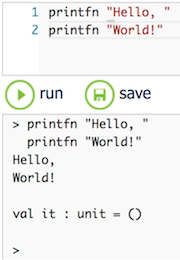

# Day #1
Let's start our F# journey with the obligatory "Hello, World!" program ;-) Here's how it looks in the online F# editor at tryfsharp.org:


_printfn_ (print formatted) is the function you call to write data to standard output as text. It prints the data and advances the cursor to the next line:



If you use _printf_ (without the "n") then there will be no line break between successive outputs:


## Simple function calls
This was easy - as it was supposed to be. Still there is something to learn here: How to call a function in the Functional Programming language of F#.

Just write the name of the function - _printfn_ in this example - followed by any parameters. No parentheses, no delimiters except spaces are required.[^f_parents]

[^f_parents]: However, _printfn ("Hello, World!")_ will work just fine.

Let's try this with 2 parameters:

```
printfn "Hello, %s!" "Peter"
```

Since the format string contains a placeholder ("%s") the function expects another parameter to insert into the output which becomes _Hello, Peter!_.

Common placeholders are:

* %s for strings
* %d for signed integers
* %X for upper case hexadecimal output of integers
* %f for floating point numbers
* %b for boolean values, prints _true_ or _false_
* %A for non-primitive typed data, e.g. lists


Read more about placeholders and output formatting in the [printf documentation](https://msdn.microsoft.com/en-us/library/ee370560.aspx).


## Literals


