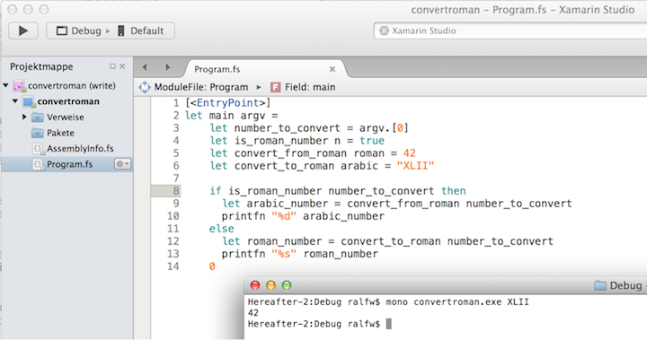
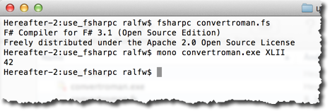

[← Day #7 – Lists](../day07) | [Day #8 – Tuples →](../day09)

# Day #8 – Arrays
Learning a language is easier when you know why, when you have a goal. That's why today's lesson starts with a kata. First the problem, then an introduction to helpful language features.

Please have a look at the [requirements document](https://app.box.com/s/z07b8gr6e1ngvb3cg7ps78zy2ddi3vx1). The requested solution is still small, but there is enough to learn in it for a couple of days.

Let's start with a list of features that need to be implemented. From that you can get an idea what's missing in your F# toolbox.

* A program, not just a function needs to be written. That means that, at least in the end, you need to use an IDE like Visual Studio or Xamarin Studio to compile the code into a standalone executable for your operating system.
* The program needs access to the command line to read the number to convert.
* The program needs to write the conversion result to standard output.
* A roman number needs to be converted to an arabic number.
* An arabic number needs to be converted to a roman number.
* A decision must be made which conversion to use.

This is all of course easy in your "mother tongue" programming language. But with F# this is different. You don't even know how to get F# code started from the command line – at least if you've followed along using one of the online REPL environments like [tryfsharp.org](http://www.tryfsharp.org/Create).

## Defining an entry point
Programs need an entry point, i.e. the operating system has to be pointed to where to start running a program's code. For F# this means a function needs to be marked as the root of all execution.

That's done with a .NET attribute like this:

```fsharp
[<EntryPoint>]
let main argv =
    printfn "Hello, World!"
    0
```

Any function can be marked as the entry point; use the attribute `[<EntryPoint>]` to do that. (Note the difference in syntax between F# and C#: attributes are enclosed in `[< >]` in F#.)

The entry point function then needs to be of type `string[] -> int`. The command line parameters are passed in as a `string` array, and it returns an `int` exit code; that's why `0` is on the last line of the function's body. Remember: `printf` does not return a real value, just `unit`.

In C# this looks a bit more elaborate: a class is needed, the method must be made static, curly braces delineate the scope of the function, there is no "native" function to write to standard output; it can but need not return an exit code.

```csharp
class Program {
  static int Main(string[] args) {
    System.Console.WriteLine("Hello, World!");
    return 0;
  }
}
```

## Arrays
The command line arguments are passed into the entry point function as an array. So far you have seen how lists work. But arrays?

They are similar to lists, as you can see here:

```fsharp
let numberList = [1;2;3]
let numberArray = [|1;2;3|]

let nestedLists = [[1;2]; [3;4;5]]
let nestedArrays = [| [|1;2|]; [|3;4;5|] |]

let square x = x * x

List.map square numberList
Array.map square numberArray

printfn "%d" numberList.[0]
printfn "%d" numberArray.[0]
```

Array literals are denoted by `[|` and `|]`, though. But to get at an array element you use `.[index]` like for lists.

So why have arrays and lists, if they are so similar? The difference is beneath the surface.

Lists are immutable and of dynamic size. But arrays are mutable and of fixed size.

Here's how you change an element of an array:

```fsharp
numberArray.[0] <- 99
```

Use either the `<-` operator or the `set` function:

```fsharp
Array.set numberArray 0 99
```

The fixed-size nature of arrays becomes apparent when you create them. You can use a literal like above, or the `create` function:

```fsharp
let numberArray = Array.create 3 0
numberArray.[0] <- 1
numberArray.[1] <- 2
numberArray.[2] <- 3
```

Lists are meant to grow. That's why there are operators like `::` and `@` and even more F# features tailored to list manipulation.

Arrays are not meant to grow. So there are no special language features for that. Nevertheless, you can append to or "contract" arrays – but this always creates new arrays.

```fsharp
let numbers = Array.append [|1;2|] [|3;4;5|]
let middlePart = Array.sub numbers 1 3
```

`Array.sub` extracts a number of array elements starting at a specified index.

Alternatively, you can use index ranges to extract stretches of array elements:

```fsharp
numbers.[1..3] // like Array.sub numbers 1 3
numbers.[3..] // start at index 3
numbers.[..3] // only up to index 3
```

How to choose between arrays and lists? Let your default be lists. They are more flexible. But if you need more efficiency or mutability or interoperability with the CLR/BCL, then choose arrays.

And in case you can't decide... you can start with one and later switch to the other ;-).

```fsharp
let numberList = Array.toList [|1;2;3|]  
let numberArray = List.toArray [1;2;3]
```

Read more about arrays in the [language documentation](https://msdn.microsoft.com/en-us/library/dd233214.aspx) if you like. There are quite some features to be discovered.

## A walking skeleton
Now that you know how to get F# code running as a standalone program and can read data from the command line, a walking skeleton for the solution seems within reach.

Its purpose would be to outline the processing. The major features should be visible, but not fleshed out. Just stubs to keep the data flowing.

Here's how that could look using the features of F# presented so far:



You find the full source in the [repo](src/convertroman/Program.fs).

***

Three out of six features implemented. Not bad for a short day of F#. But how to decide between the number systems? That's the topic for tomorrow.

***

PS. Just in case you want to know: you don't really need an IDE for this kind of project. You can stick to a text editor like [Sublime](http://www.sublimetext.com) and use _fsharpc_, the F# command line compiler.



The compiler comes with Mono, like the C# compiler.

[← Day #7 – Lists](../day07) | [Day #8 – Tuples →](../day09)
