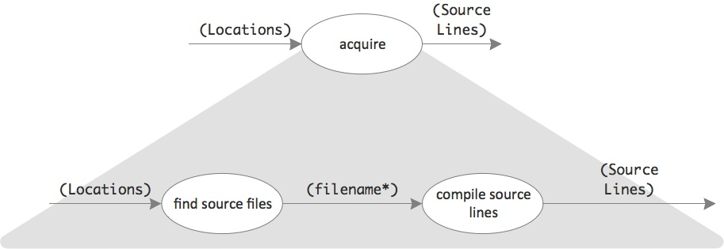
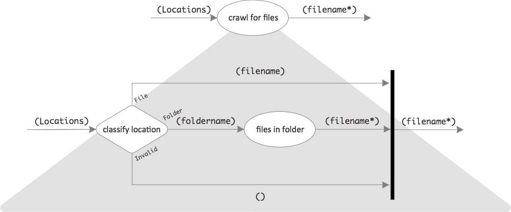
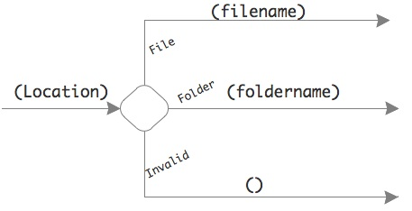
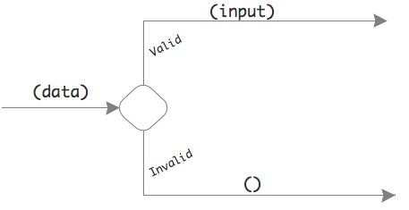

# Day #17 - Active patterns
Yesterday the focus was on gathering all the source lines to count from a list of files. That was step to in this sub-process:



Today question to be answered is: How to find all the relevant files?

## Solution design III
The source files to analyze are given by name or by folder on the command line. The program first needs to check if they exist; and in case of folders it needs to crawl them for relevant files. Non-existing files are skipped; no exception needs to be thrown.


Filtering sure is easy: only .cs files are relevant. But how to crawl? First a location has to be classified as valid filename or a valid foldername or as an invalid location. Only then the files in a folder can be compiled.



## Implementation III
The implementation of this solution approach seems to be technically straightforward. The top level of today's focus in the design can be translated like this:

```fsharp
let internal find_source_files (locations:Datamodel.Locations) : string list =
	...
	locations |> crawl_for_files 
   	          |> filter_files
```

Also filtering is easily done:

```fsharp
let filter_files =
    let is_relevant_file filename =
        System.IO.Path.GetExtension(filename) = ".cs"

    List.filter is_relevant_file
```

But how to translate the location classification? Sure, that can be done with some _if-then-else_ expressions. But that does not sound very F#-like. A _match-with_ would be better. However, the three cases which need to be distinguished cannot be recognized statically. A _Location_ does not give away whether it's a filename or a foldername just by looking at its string value.

If locations were just filenames then a _match-with_ would be easy. Classification could encode a valid filename as _Some filename_, and an invalid one as _None_.

```fsharp
let classify filename =
	...
	
location |> classify
         |> function
            | Some filename -> ...
            | None -> ...
```

Remember: _function_ is a shortcut for _match-with_. It's a function to take a value to compare to its patterns.

In this case, though, there are three cases to distinguish. What to do?

## Dynamic pattern matching
Wouldn't it be nice to be able to do the above binary classification like this?

```fsharp
locaction |> classify
             | Some filename -> ...
             | None -> ...
```

But that's not possible. Functions can have only have one result. That's why the classification needed to return an Option type value and let a subsequent _match-with_ decide upon it.

Or maybe not :-) In fact F# functions can have multiple completely different exit points, not just one. However the syntax for that is a bit different. In the case of the location classification the application of such a function would look like this:

```fsharp
location |> function
            | File filename -> ...
            | Folder foldername -> ...
            | Invalid -> ...
```

Yes, that's one 1 function which gets called. But since it has 3 different exits it's not called by a single name. Instead just the exit points are referenced.

Think of a function like

```fsharp
let classify location =
	...
	return Some location
	...
	return None
```

as a function with a single entry point and a single exit point.


Usually the function name is thought of being a label for the entry point/input whereas the exit point/output has no name.


For imperative languages like C# or Java or Ruby that's perfectly fine. But what if function can have more than one output? Wouldn't it then be more useful to refer to the results by name instead of the single entry point?


That's what F# allows you to do. How to do it you can see above: Use the multi-exit function in a _match-with_ to decide how to continue processing depending on which output data flows out of it. Use the different output names as references to the function. Even though there are several the function will only get called once, though.

But how to define such a multi-exit function? Here's how you do it for the location classification:

```fsharp
let (|File|Folder|Invalid|) location =
    if System.IO.File.Exists(location) then File location
    else if System.IO.Directory.Exists(location) then Folder location 
    else Invalid
```

Instead of one function name you give it three, one for each output. You separate them by | and enclose them in "banana brackets" (|...|). This would be a depiction of it:


"classify" is only written inside the shape to remind you of what the function is about. In reality only the outputs have a name. An even more appropriate picture then would like this:



To denote the exit through which data is supposed to flow out of the function you name it and "attach" the result, e.g.

```fsharp
let (|File|Folder|Invalid|) location =
    ...
    File location
    ...
    Folder location
    ...
    Invalid
```

It's like with the Option type where you define a value to be _Some location_ or _None_.

This way of deciding about how processing should continue is called Active Patterns. It's "patterns" because it requires a _match-with_ to work. It's called "active" because the matching is not done by fixed structural patterns but arbitrary computations at runtime. The patterns are dynamic so to speak.

Instead of the pattern itself you refer to them by a category name in your _match-with_.

### Complete Active Patterns
Active Patterns come in flavors. The one above is a so called complete Active Pattern. That means it has an arbitrary number of outputs.

That's probably the Active Pattern you will use most. The function's return values all have a very specifc type.

### Incomplete Active Patterns
But then there are also incomplete Active Patterns for simple cases with only two outputs.

Think of a bifurcation in your processing data flow because of some validation. Either the data is valid or it's not.



```fsharp
data |> function
        | Valid input -> ...
        | _ -> ...
```

The Active Pattern for this case can look simpler:

```fsharp
let (|Valid|_|) data =
    if ... then Some data
    else None
```

It has "slots" for two exit points, but only the first one is named. And it returns values of an Option type. The named output represents the _Some_ value, the output with the placeholder character _ represents the _None_ value. And it's the this second output which lead to calling this Active Pattern incomplete. "None" just is not very specific; it's used for data which cannot or should not be categorized more specifically. Thus the categorization done by the function is incomplete or partial.

### Active Patterns with parameters
What if an Active Pattern function requires more than a single input? Maybe the validation is dependent on regex pattern.

Whatever extra parameters are necessary have to go before (!) the value to categorize, e.g.

```fsharp
let (|Valid|_|) pattern data =
    if ... then Some data
    else None

data |> function
        | Valid "^\d*$" input -> ...
        | _ -> ...
```

***

Active Patterns are a powerful tool. They make it easy to stay in the functional style of programming even when it comes to decisions. See [here](../../week03/day15/src/loc/loc/Filesystem.fs) for the full solution for file system access.

### Read more
Active patterns

* Microsoft, [Active Patterns](https://msdn.microsoft.com/en-us/library/Dd233248.aspx)
* Wikibooks, [F Sharp Programming / Active Patterns](https://en.wikibooks.org/wiki/F_Sharp_Programming/Active_Patterns)
* Jessica Kerr, [Pattern Matching in F# Part 2: Active Patterns](http://www.developerfusion.com/article/133772/pattern-matching-in-f-part-2-active-patterns/)
* Chris Smith, [Introduction to F# Active Patterns](http://blogs.msdn.com/b/chrsmith/archive/2008/02/21/introduction-to-f_2300_-active-patterns.aspx)
* Scott Wlaschin, [Active patterns](http://fsharpforfunandprofit.com/posts/convenience-active-patterns/)

